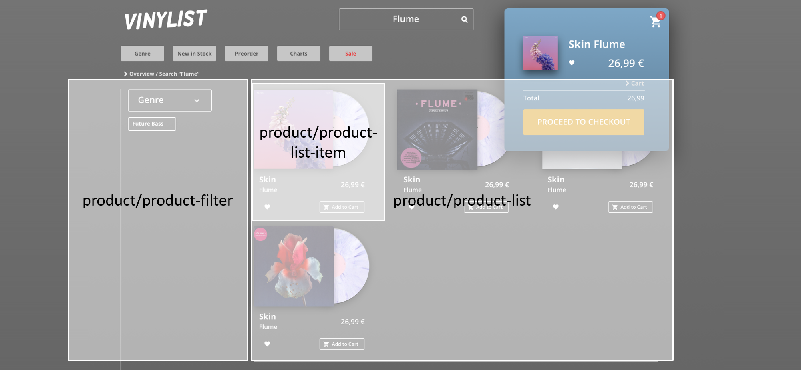
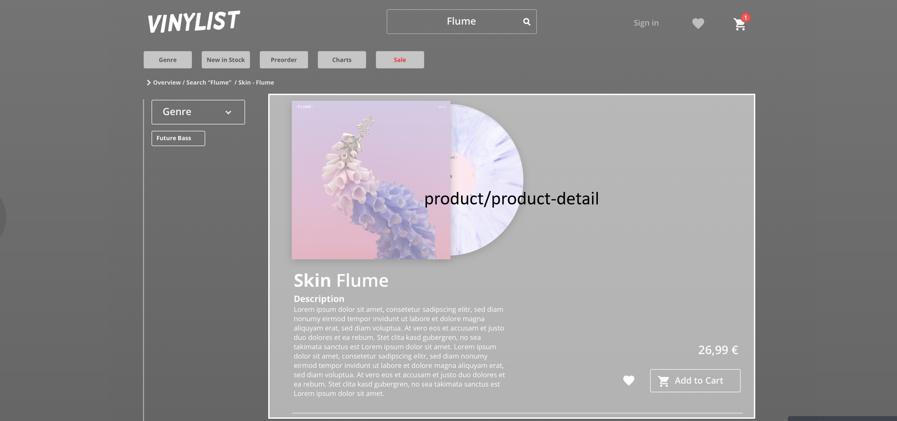
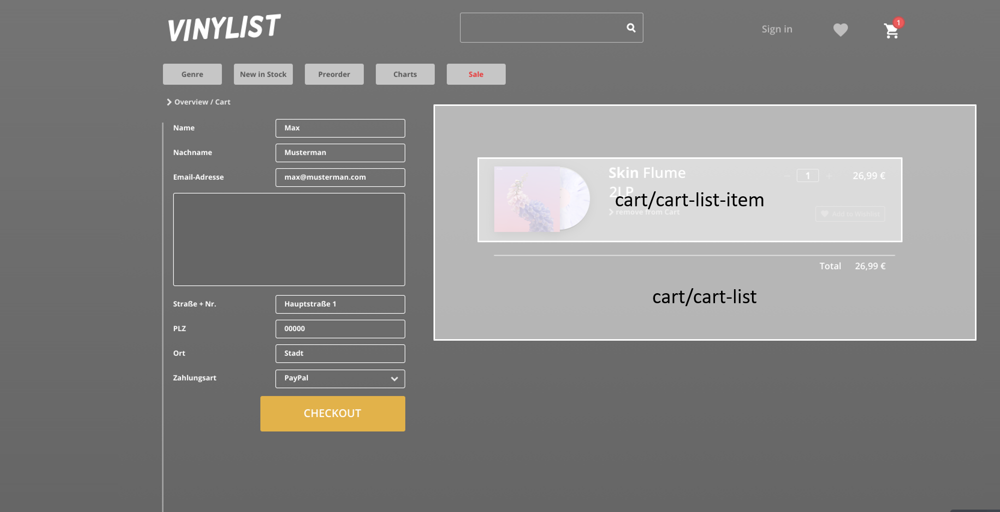
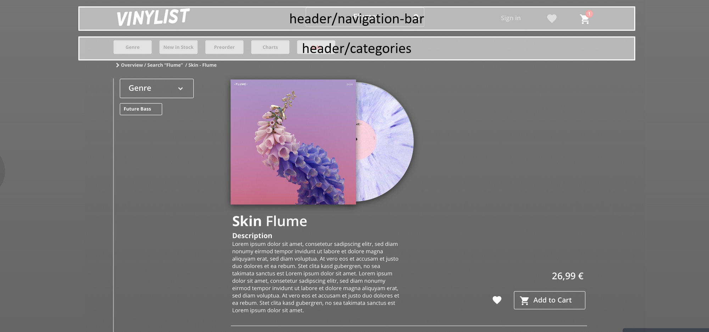
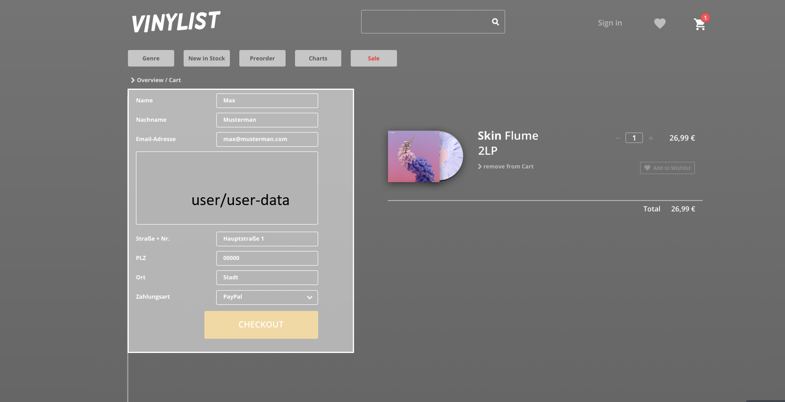

# webspec3

This project was generated with [Angular CLI](https://github.com/angular/angular-cli) version 1.6.3.

## Development server

Run `ng serve` for a dev server. Navigate to `http://localhost:4200/`. The app will automatically reload if you change any of the source files.

## Code scaffolding

Run `ng generate component component-name` to generate a new component. You can also use `ng generate directive|pipe|service|class|guard|interface|enum|module`.

## Build

Run `ng build` to build the project. The build artifacts will be stored in the `dist/` directory. Use the `-prod` flag for a production build.

## Running unit tests

Run `ng test` to execute the unit tests via [Karma](https://karma-runner.github.io).

## Running end-to-end tests

Run `ng e2e` to execute the end-to-end tests via [Protractor](http://www.protractortest.org/).

## New project structure

### App Module

The App Module contains the splashscreen (when visiting the page) and the footer.

### Product Module

The product module contains all components concerning the products - the product-detail when clicking on a vinyl, the product filter on the left, the product list and the items in this list. Furthermore there's a product service where the backend communication will be performed.

### Cart Module

In the cart module we have the cart list component and the cart list item component, as well as the cart modal (when clicking on the cart icon).

### Header Module

The header module contains all components defining the header of the page - so it contains the navigation bar and the categories.

### User Module

All user specific components are located in the user module. We also have a user service (again for communicating with the backend), the user data component for the cart and the login component. Here we can also add the wishlist and some kind of user profile.

## How to use i18n

If you add some text which should be translatable (e.g. `
Hello party people!
`), please add the translation in both of the .json-Files (found under `assets/i18n`) and replace the text in the template with a pipe, that navigates to your translation (`
{{ 'HERE_GOES_THE_PATH.TO_YOUR_TRANSLATION' | translate }}
`).

To keep the .json-Files easily understandable and reproducable, please put your translations under a section, that is named after the component your translated text is located in (written in uppercase and "-" replaced with an underscore).

## Angular Material

To get nice results quickly and without writing endless complicated css-Files, we can use [Angular Material](https://material.angular.io/). You can search the website for various [Components](https://material.angular.io/components/categories) and just add the needed imports in the `core/material.module.ts` file, which is imported into the `app.module.ts`.

Just take a look at the API-Section of each component to determine which module you need to import.

As some material components aren't styleable within your component's scss-file, you may need to add some styling directly into `scss/styles.scss` and mark it with an important flag.

## Coloring

For the main coloring you can use the custom theme (`scss/custom-theme.scss`), where the primary, accent and warn color is defined. For other fixed color variables, please use `scss/_variables.scss` to add your color. Also check this file before declaring another color randomly, as it may already exist a very similar color which you can use instead.

If you want to use some of the color variables of the theme or `_variables.scss`, you have to import the `styles` file in your component's scss file via `@import '[...]/sass/styles';`

## Further help

To get more help on the Angular CLI use `ng help` or go check out the [Angular CLI README](https://github.com/angular/angular-cli/blob/master/README.md).
